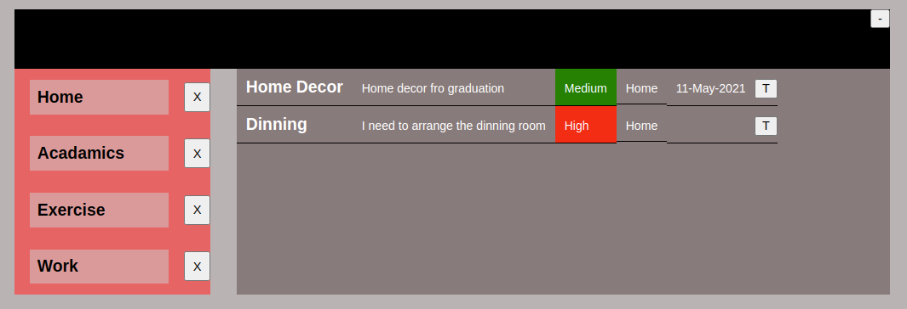

# todo-list
This project is building a To-do list app to practice JavaScript's Objects, Factory Functions and Module Patterns concepts

## Description 
The todo list app lets users create todo objects with title, description, date, project and priority. 
The users are provided with a custom made calendar UI module backed by a logic Calendar class. 
The user can delete todo object and project object also.

## Main features 

### NavBar 
The navbar has the add task form button which renders the add task form on click event.

### The left section 
The left section holds a ul element with lists of project names 

### The midde section 
The middle section dislays all the todos by default or it can also display in project category by onclick event of the project li elements in the left section.

### The Task Form 
The task form is a very important part of this app which lets users a user friendly interactive interface. It has

- A title text field to insert title of the project 
- A projects select element which lists all the available projects of the user and the user can make additional todo list on existing projects. There are three deafult projects; Home, Woek and Exercise.
- A new Project text field to add a new Project which is not currently existing. If this field is filled with text the projects select options will be ignored.
- A priority select field with oprions of High, Low and Medium. Those options wil be reflected with different colors in the todo list.
- A description text area to fill the description of the todo.
and 

- A calendar

All the values of the form fields are captured by a todo object which will be assigned an ID to, and stored in a local storage. 

### Calendar UI 
The calendar has 
- A year select element with options of 5 years from 2021
- A month select element with options of all the 12 months 
- A weekdays div element displaying the days of the week from monday to Sunday
- A dateDiv element holding all the days of the month corresponding to the year, and wth the correct weekday position. 

- The calendar UI is backed by a Calendar class which accepts year and month as argument and returns the starting day of the month in the weekdays, and the length of the month, which, as far as preliminary tests concerned is valid for 1900 to 2100 BC, Gregorian calendar.

### Filters 
A dedicated Filter class is developed to filter the todos with respect to project category or time as necessary.

### Storage 
A local storage based Storage class is applied to store (set), access (get), modify(edit), remove (delete) todo objects with their unique IDs.

### Demo 
- Home page 

- Menu Page

- Contact page

## Unit Testing 
For unit testing please clone the repo and run the tests with two simple steps:
- git clone git@github.com:henatan99/todo-list.git 
- cd into the project root directory and run 'npm run test' on terminal 

## Built With

- Javscript
- HTML/CSS
- Webpack 
- npm 
- package.json 

## Live Link

## Authors

👤 **Henok Mossissa**

- GitHub: [@henatan99](https://github.com/henatan99)
- Twitter: [@henatan99](https://twitter.com/henatan99)
- LinkedIn: [Henok Mossissa](https://www.linkedin.com/in/henok-mekonnen-2a251613/)

## :handshake: Contributing

Contributions, issues, and feature requests are welcome!

## Show your support

Give a :star:️ if you like this project!

## Acknowledgment 

## :memo: License

This project is [MIT](./LICENSE) licensed.